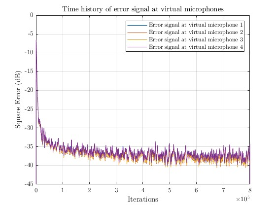
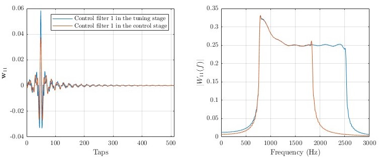

# Multichannel Virtual Sensing Active Noise Control
## Introduction
The multichannel virtual sensing active noise control (MVANC) methodology is an advanced approach that may provide a wide area of silence at specific virtual positions that are distant from the physical error microphones. Currently, there is a scarcity of open-source programs available for the MVANC algorithm. This work presents a MATLAB code for the MVANC approach, utilizing the multichannel filtered-x least mean square (MCFxLMS) algorithm. The code is designed to be applicable to systems with any number of channels.

## Code Explanation
### Key MATLAB Files
- [`CreatReferenceSignal.m`](#function-creatreferencesignal): This code is utilized to generates the filtered reference signals and disturbances.
- [`MultichannelFxLMS.m`](#function-multichannelfxlms): The code of the multichannel filterd reference least mean sqaure (McFxLMS) algorithm.
- [`AuxiliaryLMS.m`](#function-auxiliarylms): The code is used to obtain the auxiliary filters.
- [`ContrFxLMS.m`](#function-contrfxlms): The code of the control stage of the virtual sensing ANC. 
- [`VirtualSensing_test.m`](#testing-code-four-channel-virtual-sensing-active-nose-control-system): The main testing program of the vritual ANC codes. 

## Function: CreatReferenceSignal
The MVANC technique utilizes the FxLMS algorithm to adaptively update the control filter coefficients. Therefore, <font color=blue>`CreatReferenceSignal.m`</font> generates the reference signals filtered by the physical secondary path and the virtual secondary path respectively. In addition, it produces disturbances at the location of the physical microphone and virtual microphone respectively. These signals will later be used in other functions.

```matlab
    function [Dv,Dp,Fx_v,Fx_p] = CreatReferenceSignal(Pv,Pp,Sv,Sp,PriNoise,N,L,K,M,J)
%% -----------------------------------------------------------
% Inputs:
% Pv is the virtual primary path. 
% Pp is the physical primary path. 
% Sv is the virtual secondary path.
% Sp is the physical secondary path.
% PriNoise is the primary noise. 
% N is the number of simulation cycles.
% L is the length of control filter.
% K is the number of secondary sources.
% M is the number of virtual microphones.
% J is the number of physical microphones.
% Outputs:
% Dv is the disturbance at virtual microphone.
% Dp is the disturbance at physical microphone.
% Fx_v is the reference signal filtered by virtual secondary path.
% Fx_p is the reference signal filtered by physical secondary path.
%% -----------------------------------------------------------
Dp = zeros(N,J);
for i=1:J
    Dp(:,i) = filter(Pp(:,i),1,PriNoise);
end
Dv = zeros(N,M);
for i=1:M
    Dv(:,i) = filter(Pv(:,i),1,PriNoise);
end
Fx_p = zeros(N+L-1,J,K);
for i = 1:K 
    for j = 1:J
        Fx_p(:,j,i) = [zeros(L-1,1);filter(Sp(:,j,i),1,PriNoise)];
    end
end
Fx_v = zeros(N+L-1,M,K); 
for i = 1:K 
    for j = 1:M
        Fx_v(:,j,i) = [zeros(L-1,1);filter(Sv(:,j,i),1,PriNoise)]; 
    end
end
end
```

In this code snippet, $Dv$ is used to store the disturbances at virtual microphones and has a dimension of $N$ by $M$, while $Dp$ is used to store the disturbances at physical microphones and has a dimension of $N$ by $J$. In addition, $Fx\\_v$ is used to store the reference signals filtered by virtual secondary paths and has a dimension of $N$ by $M$ by $K$, while $Fx\\_p$ is used to store the reference signals filtered by virtual secondary paths and has a dimension of $N$ by $J$ by $K$. $N$, $M$, $J$ and $K$ denote the simulation cycle number, the number of virtual error microphones, the number of physical error microphones and the number of secondary sources respectively.

## Function: MultichannelFxLMS
In the tuning stage of the MVANC technique, the optimal control filters are first trained by `MultichannelFxLMS.m` using the FxLMS algorithm.

```matlab
function [W,Er]= MultichannelFxLMS(L,K,M,N,Fx_v,Dv,StepSize)
%% -----------------------------------------------------------
% Inputs:
% L is the length of control filter.
% K is the number of secondary sources.
% M is the number of virtual microphones. 
% N is the number of simulation cycles.
% Fx_v is the reference signal filtered by virtual secondary path. 
% Dv is the disturbance at virtual microphone.
% StepSize is the stepsize of FxLMS algorithm.
% Outputs:
% W is the control filter matrix.
% Er is the error signal at virtual microphone.
%% -----------------------------------------------------------
W  = zeros(K*L,1); 
FX = zeros(M,K*L); 
Er = zeros(M,N); 
for i = 1:N
    for j = 1:M
        for kk= 1:K
            FX(j,(kk-1)*L+1:kk*L) = Fx_v(i+L-1:-1:i,j,kk)';
        end
    end
    Ev = Dv(i,:)'- FX*W;
    SX = StepSize*Ev'*FX;
    W  = W + SX';
    Er(:,i) = Ev;
end
end
```
In this code snippet, $W$ is used to store the optimal control filters trained using the FxLMS algorithm and has a dimension of $K$ by $L$, where $L$ denotes the length of the control filter. $Er$ is used to store the error signals at virtual microphones and has a dimension of $M$ by $N$.

## Function: AuxiliaryLMS
After the control filter converges, the optimal control filters are then used by `AuxiliaryLMS.m` to train the auxiliary filters using the LMS algorithm.

```matlab
function [H,Er]=AuxiliaryLMS(L,K,J,N,Fx_p,Dp,PriNoise,W,StepSize)
%% -----------------------------------------------------------
% Inputs:
% L is the length of control filter.
% K is the number of secondary source.
% J is the number of physical microphones. 
% N is the number of simulation cycle.
% Fx_p is the reference signal filtered by physical secondary path.
% Dp is the disturbance at physical microphone.
% W is the optimal control filter matrix.
% StepSize is the stepsize of LMS algorithm.
% Outputs:
% H is the auxiliary filter matrix.
% Er is the error signal of LMS algorithm.
%% -----------------------------------------------------------
H  = zeros(J*L,1); 
SH = zeros(J*L,1); 
FX = zeros(J,K*L); 
YH = zeros(J,1); % The output signal of the auxiliary fitler.
Er = zeros(J,N)  ;
X  = [zeros(L-1,1); PriNoise];
for i = 1:N
    for j = 1:J
        for kk = 1:K 
            FX(j,(kk-1)*L+1:kk*L) = Fx_p(i+L-1:-1:i,j,kk)';
        end
        YH(j) =  X(i+L-1:-1:i)'*H((j-1)*L+1:j*L);
    end
    Ep = Dp(i,:)'-FX*W; % The error signal at physical microphone.
    Eh = Ep - YH;
    for j = 1:J
        SH((j-1)*L+1:j*L) = StepSize*Eh(j)*X(i+L-1:-1:i);
    end
    H = H + SH;
    Er(:,i) = Eh;
end
end
```

In this code snippet, $H$ is used to store the optimal auxiliary filters trained using the LMS algorithm and has a dimension of $J$ by $L$. $Er$ is used to store the error signals and has a dimension of $J$ by $N$.

## Function: ContrFxLMS

In the control stage of the MVANC technique, the optimal auxiliary filers are used by `ContrFxLMS.m` to train the new control filters using the FxLMS algorithm.

```matlab
function [WC,ErPhysic,ErVirt] = ContrFxLMS(L,K,M,J,N,Fx_p,Fx_v,Dp,Dv,PriNoise,H,StepSize) 
%% ------------------------------------------------------------------------
% Inputs:
% L is the length of control filter.
% K is the number of secondary source.
% M is the number of virtual microphones. 
% J is the number of physical microphones. 
% N is the number of simulation cycle.
% Fx_p is the reference signal filtered by physical secondary path.
% Fx_v is the reference signal filtered by virtual secondary path. 
% Dp is the disturbance at physical microphone.
% Dv is the disturbance at virtual microphone.
% H is the optimal auxiliary filter matrix.
% StepSize is the stepsize of FxLMS algorithm.
% Outputs:
% WC is the new control filter matrix.
% ErPhysic is the error signal at physical microphone.
% ErVirt is the error signal at virtual microphone.
%% ------------------------------------------------------------------------
FX = zeros(J,K*L);
FV = zeros(M,K*L);
WC = zeros(K*L,1); 
ErPhysic = zeros(J,N); 
ErVirt   = zeros(M,N); 
XH       = zeros(N,J);
for i = 1:J 
    XH(:,i) = filter(H((i-1)*L+1:i*L),1,PriNoise);
end
for i=1:N
    for j = 1:J
        for kk = 1:K 
            FX(j,(kk-1)*L+1:kk*L) = Fx_p(i+L-1:-1:i,j,kk)';
        end
    end
    for j = 1:M
        for kk = 1:K 
            FV(j,(kk-1)*L+1:kk*L) = Fx_v(i+L-1:-1:i,j,kk)';
        end
    end
    Ep      = Dp(i,:)' - FX*WC; 
    ErVirt(:,i) = Dv(i,:)' - FV*WC; 
    Eh      = Ep-XH(i,:)';
    WC      = WC + (StepSize*Eh'*FX)';
    ErPhysic(:,i) = Ep;
end
end
```

In this code snippet, $WC$ is used to store the new control filters trained using the FxLMS algorithm and has a dimension of $K$ by $L$. $ErPhysic$ is used to store the error signals at physical microphones which have a dimension of $J$ by $N$, while $ErVirt$ is used to store the error signals at virtual microphones which have a dimension of $M$ by $N$.

## Testing Code: Four Channel Virtual Sensing Active Nose Control System

The `VirtualSensing_test.m` carries out a simulation on a 1x4x4 MVANC system, where there is $1$ reference microphone, $4$ secondary sources, $4$ physical microphones and $4$ virtual microphones. In the simulation, `CreatReferenceSignal.m`, `MultichannelFxLMS.m`, `AuxiliaryLMS.m` and `ContrFxLMS.m` are used to achieve noise control at desired virtual locations.

### System Configuration

The following commands define basic system configuration parameters. Specifically, the sampling frequency of the system is set to 16 kHz and the length of control filters is set to 512 taps.

```matlab
Fs         = 16000       ; % System sampling freqnecy (Hz).
T          = 50          ; % The duration of the simutation (Second).
t          = 0:1/Fs:T    ; % The cycle of simulation. 
N          = length(t)   ; % The number of cycle of simulation. 
L          = 512         ; % The lenght of the control filter. 
K          = 4           ; % The number of the seconeary sources. 
J          = 4           ; % The number of the physical microphones.
M          = 4           ; % The number of the virtual microphones.
```

### Creating Primary Noise for Tuning and Control

The following commands generate a broadband noise of 800-2500 Hz as reference signals in the tuning stage and a broadband noise of 800-1800 Hz as reference signals in the control stage by filtering white noise through different bandpass filters.

```matlab
Fs1_tuning  = 800;
Fs2_tuning  = 2500;
ws1_tuning  = 2*(Fs1_tuning/Fs);
ws2_tuning  = 2*(Fs2_tuning/Fs);
BPF_tuning = fir1(512,[ws1_tuning,ws2_tuning]);
PriNoise_tuning = filter(BPF_tuning,1,2*randn(N,1));
% Creating primary noise for control.
Fs1_control  = 800;
Fs2_control  = 1800;
ws1_control  = 2*(Fs1_control/Fs);
ws2_control  = 2*(Fs2_control/Fs);
BPF_control = fir1(512,[ws1_control,ws2_control]);
PriNoise_control = filter(BPF_control,1,2*randn(N,1));
```

### Loading Primary and Secondary Paths

The primary path is the path that the noise takes from the noise source to the error microphone, and the secondary path is the path that the anti-noise takes from the secondary source to the error microphone. Both of these paths are essential to the detection of errors. As a result, physical paths are distinct from virtual paths due to the fact that the physical microphones and virtual microphones are situated in distinct locations. In this context, the primary paths and the secondary paths are loaded from files.The length of the primary paths is 128 and the length of the secondary paths is 32.

```matlab
% Load physical primary and secondary path.
Pp = load('PrimaryPath_P_4.mat').Pp;
Sp = load('PhysicalPath16.mat').Sp;
% Load virtual primary and secondary path.
Pv = load('PrimaryPath_V_4.mat').Pv;
Sv = load('VirtualPath16.mat').Sv;
```

### Creating Disturbances and Filtered-Reference Signals

The following commands generate disturbance signals by filtering the reference signal through the primary path and filtered reference signals by filtering the reference signal through the secondary path. Specifically, different disturbance and filtered reference signals are generated with primary noises in the tuning and control stages, respectively.

```matlab
% Creating disturbances and filtered reference signals for tuning noise.
[Dv_tuning,Dp_tuning,Fx_v_tuning,Fx_p_tuning] = CreatReferenceSignal(Pv,Pp,Sv,Sp,PriNoise_tuning,N,L,K,M,J);
% Creating disturbances and filtered reference signals for control noise.
[Dv_control,Dp_control,Fx_v_control,Fx_p_control] = CreatReferenceSignal(Pv,Pp,Sv,Sp,PriNoise_control,N,L,K,M,J);
```

### Tuning Stage 1: Training the Optimal Control Filters

The following commands train the optimal control filters using the FxLMS algorithm with a stepsize of 0.000001.

```matlab
u1 = 0.000001; % Stepsize of the FxLMS algorithm.
[W,Er] = MultichannelFxLMS(L,K,M,N,Fx_v_tuning,Dv_tuning,u1);
```

### Tuning Stage 2: Training the Auxiliary Filters
The following commands train the auxiliary filters using the LMS algorithm with a stepsize of 0.001.

```matlab
u2 = 0.001; % Stepsize of the LMS algorithm.
[H,Er] = AuxiliaryLMS(L,K,J,N,Fx_p_tuning,Dp_tuning,PriNoise_tuning,W,u2);
```

### Control Stage: Training the New Control Filters

The following commands train the new control filters using the FxLMS algorithm with a stepsize of 0.00001.

```matlab
u3 = 0.00001; % Stepsize of the FxLMS algorithm.
[WC,Er,Ev] = ContrFxLMS(L,K,M,J,N,Fx_p_control,Fx_v_control,Dp_control,Dv_control,PriNoise_control,H,u3);
```

### Drawing the Figure of Error Signals

Drawing the error signals of the four virtual microphones.

```matlab
set(groot,'defaultAxesTickLabelInterpreter','latex');
figure  
plot(10*log10(smooth(Ev(1,:).^2,2048,'moving')))
hold on
plot(10*log10(smooth(Ev(2,:).^2,2048,'moving')))
hold on 
plot(10*log10(smooth(Ev(3,:).^2,2048,'moving')))
hold on
plot(10*log10(smooth(Ev(4,:).^2,2048,'moving')))
xlim([0 800001])
ylim([-45 0])
xlabel('Iterations','Interpreter','latex')
ylabel('Square Error (dB)','Interpreter','latex')
title('Time history of error signal at virtual microphones','Interpreter','latex')
legend('Error signal at virtual microphone 1','Error signal at virtual microphone 2','Error signal at virtual microphone 3','Error signal at virtual microphone 4','Interpreter','latex')
grid on
```

  
Fiure 5. Simulated error signals at four virtual microphones of the MVANC system.

It can be seen from Figure 5 that the MVANC system can achieve noise control at the virtual locations and the noise reduction performance is around 40 dB. 

### Drawing the Figure of Control Filter Coefficient

Drawing the control filter 1 coefficients in both tuning and control stages. The remaining three control filters are very similar to control filter 1.

```matlab
figure 
subplot(1,2,1)
plot(1:L,W(1:L),1:L,WC(1:L))
grid on
xlabel('Taps','Interpreter','latex')
ylabel('${{\bf{w}}_{11}}$','Interpreter','latex')
legend('Control filter 1 in the tuning stage','Control filter 1 in the control stage','Interpreter','latex')
xlim([0,512])
subplot(1,2,2)
[H, F] = freqz(W(1:L), 1, 1024, Fs);
plot(F, abs(H));
hold on
[H, F] = freqz(WC(1:L), 1, 1024, Fs);
plot(F, abs(H));
grid on
xlim([0,3000])
xlabel('Frequency (Hz)','Interpreter','latex')
ylabel('$|{W_{11}}(f)|$','Interpreter','latex')
```

  
Figur 6. Simulated control filter 1 coefficients of the MVANC system.

It can be seen from Figure 6 that the control filter 1 derived from the tuning stage exhibits a passband within the 800 to 2500 Hz
frequency range. Conversely, control filter 1 from the control stage demonstrates a passband within the narrower 800 to 1800 Hz range. This result is consistent with the different primary noises used in the tuning and control stages.

## Reference 
``` bibtex
@article{shi2020feedforward,
  title={Feedforward multichannel virtual-sensing active control of noise through an aperture: Analysis on causality and sensor-actuator constraints},
  author={Shi, Dongyuan and Gan, Woon-Seng and Lam, Bhan and Hasegawa, Rina and Kajikawa, Yoshinobu},
  journal={The Journal of the Acoustical Society of America},
  volume={147},
  number={1},
  pages={32--48},
  year={2020},
  publisher={AIP Publishing}
}
```